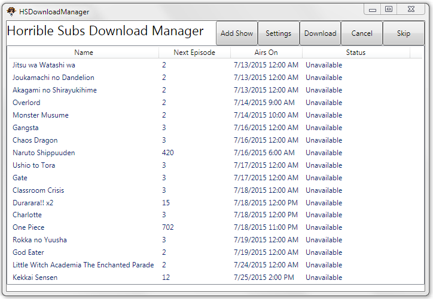

# HSDownloadManager
An anime tracker/downloader for windows. If you want to work on this, feel free to fork or open issues.

Note: Sometimes anti-virus software like AVG flag this application because of the way the XDCC protocol works. It's not malicious, I promise. If you don't trust me, try reading the source and compiling yourself.

##What It Does
This application is a download manager for the horrible subs group. You can find more information about horrible subs at http://horriblesubs.info

Horrible subs produces "fan-subbed" anime and makes it freely available to the public. They provide torrents as well as direct downloads over a protocol called XDCC, which is built on top of IRC and CTCP. This application tracks when the next episode of an anime becomes available, and automatically downloads it using the XDCC protocol.

##How to Use It
Download the setup zip file from the [Latest Build](LatestBuild) folder and extract it. Then run setup.exe to install and run the application.

Once the application is installed, go into the Settings menu and add an IRC username and select a folder to download to. The password field is currently unused.

If you're familiar with the XDCC system, you can input the IRC nickname of the bot you prefer to download from. If the downloader does not find a pack from the bot you specify, it will download from the first bot that responds to its search.

The other settings and buttons are fairly self explanatory.

Note: The name of the anime you input will be used in the XDCC search query, so make sure you spell it right. Otherwise you might not find an available episode. If you still can't find the pack, check http://horriblesubs.info to make sure it's not delayed.

##Disclaimer
I'm not responsible for anything bad that happens to you if you use this application. I mean, nothing will, probably, but it's still not my fault.

Also, it's brand new and kind of temperamental, so if it starts acting wonky try closing it and opening it again. It usually works after that.
